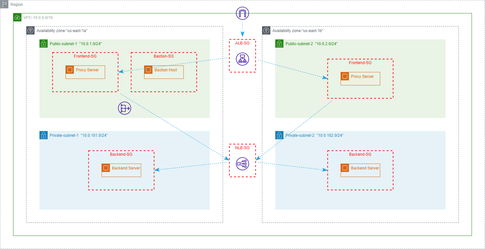
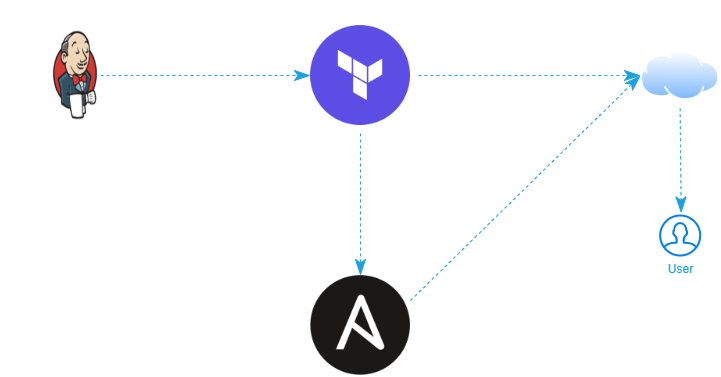

# Deploying Proxy Server AWS

Using terraform  as Intrastracture as a code (IaC) tool to deploy infrastracture on Amazon Web Server (AWS) cloud provider .

### Infrastracture


And Then using Ansible  to manage the instances through bastion host to connect to servers and to install apache2 on backend servers and nginx  on frontend server

And using Jenkins  we can deploy the infrastracture through CI/CD Pipeline.

### Path Flow


## Prerequisite:
1. AWS CLI
2. Terraform
3. Ansible

## Terraform Code
### Modules:
#### 1. Network Module:
This module is used to create VPC, subnets, and other resources related to network \
Module's variables:
|Variable |Description |
|:---|:---|
|cidr |The range of ip that will be used in infrastracture |
|azs |The Availability zones that will be used (depends on region) and will used to achieve HA|
#### 2. Security Module:
This module is used to create securtiy groups taht will be used by ec2 instances
|Security Group |Usage |
|:---|:--|
|bastion-sg |Allow SSH traffic for bastion host from any|
|frontend-sg |Allow traffic from application load-balancer only|
|backend-sg |Allow traffic from network load-balancer only|
|nlb-sg |Allow traffic from backend-sg only|
|alb-sg |Allow traffic to application from any|
Module's variables:
|Variable |Description |
|:---|:---|
|vpc-id |The ID of VPC where security groups will be created|
#### 3. Load-balancer Module:
This mdoule is used to create application and network load-balancer and their target groups \
|Variables |Description |
|:---|:---|
|alb-sg|List of security groups id that alb will use|
|nlb-sg|List of security groups id that nlb will use|
|alb-subnets|List of subnets id that will be attached to alb|
|nlb-subnets|List of subnets id that will be attached to nlb|
|vpc-id|The ID of VPC that wiil connect to ALB target group|
|azs|Availability zones|
|frontend-instance-id|The IDs of frontend instances|
|backend-instance-id|The IDs of backend instances|
### Main file:
This file where all modules are connected and create frontend, backend, and bastion servers \
terraform variable:
|Variable |Description |Default |
|:---|:---|:---|
|region |The region on AWS account where resources will be created|"us-east-1"|
|cidr |The range of ip that will be used in infrastracture|"10.0.0.0/16"|
|azs |The Availability zones that will be used (depends on region) and will used to achieve HA|["us-east-1a", "us-east-1b"]|
|instance-ami |The OS that will be used in ec2 instances|"ami-0c7217cdde317cfec"|
|instance-type |The type of ec2 instance that will be created|"t2.micro"|
|key-pair |The key pair which used to connect to ec2 instance|Must Be Added|

## Run Without Jenkins:
You will need to insure your AWS configration and authentication on you AWS email, And then enter varaibles you need in terraform code there is many ways to enter variable
1. Enter variable in `terraform.tfvars` file
2. Add needed varible (key-pair) while deploying terraform code
```
terraform apply -auto-approve
```
2. Add the value in command
```
terraform apply -var key-pair="key-pair-name" -auto-approve
```

And if your public key isn't in **~/.ssh/** directory you need to change its path to **~/.ssh/privateKeyName.pem** or change the path in **template/ssh_config** file to **~/path/to/your/private/key/private_key.pem**


## RUN With Jenkins:
You need to install the following plugins:
1. [Pipeline: AWS Steps](https://plugins.jenkins.io/pipeline-aws/) (Required)
2. [Slack Notification](https://plugins.jenkins.io/slack/) (Optional) 

And then you need to add credential for aws and with **ID: terraform**, and edit the kn variable in Jenkins file with available key-name

### Project files
```
.
├── ansible
|   ├── site.yml
│   ├── ansible.cfg
│   ├── roles
│   │   ├── backend
│   │   │   ├── handlers
│   │   │   │   └── main.yml
│   │   │   ├── tasks
│   │   │   │   └── main.yml
│   │   │   ├── templates
│   │   │   │   └── index.html.j2
│   │   │   └── vars
│   │   │       └── main.yml
│   │   └── frontend
│   │       ├── files
│   │       │   └── default
│   │       ├── handlers
│   │       │   └── main.yml
│   │       ├── tasks
│   │       │   └── main.yml
│   │       └── vars
│   │           └── main.yml
│   └── template
│       ├── inventory
│       └── ssh_config
├── img
│   ├── Ansible.png
│   ├── aws.png
│   ├── flow.png
│   ├── infra.png
│   ├── Jenkins.png
│   ├── Nginx.png
│   └── Terraform.png
├── modules
│   ├── load-balancer
│   │   ├── main.tf
│   │   ├── outputs.tf
│   │   └── vars.tf
│   ├── network
│   │   ├── main.tf
│   │   ├── outputs.tf
│   │   └── vars.tf
│   └── security
│       ├── main.tf
│       ├── outputs.tf
│       └── vars.tf
├── ansible.tf
├── main.tf
├── vars.tf
├── outputs.tf
├── Jenkinsfile
└── README.md
```
